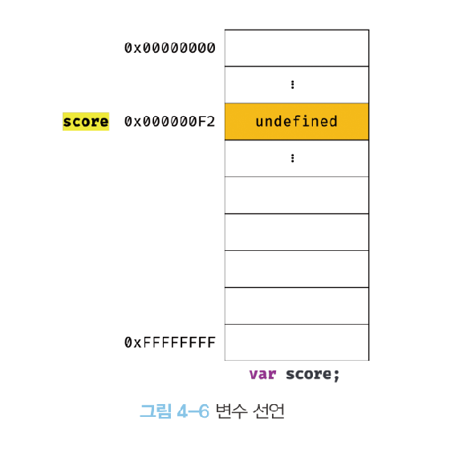

# 변수와 데이터 타입

1회차 (2022년 4월 7일 )

<style>
* {
  text-align: center;
}

h1 {
  color:#f7df1e;
}
</style>

---

# 변수란 무엇이고, 왜 필요할까?

```js
10 + 20;
```


<div class="absolute bottom-23 left-100">
<p class="box">10, 20, + 기호의 의미 </p>
<p class="box"> 10 + 20 식의 의미</p>
</div>

<style>
.box {
  border: 1px solid black;
  border-radius: 10px;
  padding: 20px;
  font-size: 36px;
  display: inline-block;
}
</style>

---

# 변수란 무엇이고, 왜 필요할까?

```js
10 + 20;
```


<style>
img{
  margin: 0 auto;
  width: 400px;
  height: 400px; 
}
</style>

---

# 변수란 무엇이고, 왜 필요할까?

```js
var result = 10 + 20;
```

<p>변수는 하나의 값을 저장하기 위해 확보한 메모리 공간 자체 또는 그 메모리 공간을 식별하기 위해 붙인 이름</p>
<p>즉, 값의 이름을 가리키는 상징적인 이름</p>


<style>
img{
  margin: 0 auto;
  width: 350px;
  height: 350px; 
}

p {
  font-size:12px;
  color: red;
}
</style>

---

# 식별자

<p>변수 이름 = 식별자</p>
<p>식별자는 어떤 값을 구별해서 식별할 수 있는 고유한 이름</p>
<p>식별자는 값이 아니라 메모리 주소를 기억</p>


<style>
img{
  margin: 0 auto;
  width: 700px;
  height: 300px; 
}

p {
  font-size:16px;
  color: red;
}
</style>

---

# 변수 선언

<p>변수 선언이란 변수를 생성하는 것</p>

<p>값을 저장하기 위한 메모리 공간을 확보하고 변수 이름과 메모리 공간의 주소를 연결해서 값을 저장할 수 있게 준비하는 것</p>
<h5>변수를 사용하려면 반드시 선언이 필요하다. 변수를 선언할 때는 var, let, const 키워드를 사용한다.</h5>
<p>(var 키워드는 선언과 초기화가 동시에 일어난다)</p>

```js
var score;
```

<div class="left">
  <p>1.선언 단계 : 변수 이름을 등록해서 자바스크립트 엔진에 변수의 존재를 알린다. </p>
  <b>변수 이름은 실행컨텍스트에 등록됨</b>
  <p>2. 초기화 단계 :  값을 저장하기 위한 메모리 공간을 확보하고 암묵적으로 undefined를 할당해 초기화한다.</p>
</div>



<style>s
img{
  margin: 0 auto;
  width: 150px;
  height: 150px; 
}

p {
  font-size:16px;
  color: red;
}

.left {
  position: absolute;
  right: 0;
  width: 400px;

  p {
    color: black;
    background-color:yellow;
  }
}
</style>

---

# 호이스팅

<div>
<p class="highlight">변수의 선언문이 선두로 끌어올려진 것처럼 동작하는 것을 변수 호이스팅이라고 한다</p>
</div>

```js
console.log(score); // undefined

var score; // 변수 선언문
```

<p>자바스크립트 엔진은 소스코드 평가과정을 통해 소스코드를 실행하기 위한 준비를 한다.</p>
<p>자바스크립트 엔진은 변수 선언을 포함한 모든 선언문(변수, 함수)을 소스코드에서 찾아내 먼저 실행한다.</p>
<p>소스 평가과정이 끝나면 변수 선언을 포함한 모든 선언문을 제외하고 소스코드를 한 줄씩 실행한다.</p>

```js
console.log(score); // undefined

score = 80; // 값의 할당
var score; // 변수 선언

console.log(score); // ?
```

<style>

p {
  font-size:16px;
}

.highlight{
  display: inline-block;
  padding:0;
  margin:0;
  background-color: yellow;
}
</style>

---

# 값의 재할당

```js
var score = 80;
score = 90;
```

<p>값을 재할당할 수 없어서 변수에 저장된 값을 변경할 수 없다면 변수가 아니라 상수라 한다.</p>
<p>가비지 콜렉터 : 참조하지 않는 메모리를 해제하는 기능</p>


<style>

p {
  font-size:16px;
}
</style>

---

# 데이터 타입

원시타입 vs 객체타입

<p class="highlight">원시값은 변하지 않는다!</p>


<style>

p {
  font-size:16px;
}

.highlight{
  font-size: 24px;
  display: inline-block;
  padding:0;
  margin:0;
  background-color: yellow;
}
</style>

---

# 데이터 타입의 필요성

데이터 타입에 의한 메모리 공간의 확보

```js
var score = 100;
```

<p>컴퓨터는 숫자 값 100을 저장하기 위해 메모리 공간을 확보한 다음, 확보된 메모리에 숫자값 100을 2진수로 저장한다.</p>
<p>자바스크립트 엔진은 데이터 타입, 즉 값의 종류에 따라 정해진 크기의 메모리 공간을 확보한다.</p>


<style>

p {
  font-size:16px;
}

img{
  margin: 0 auto;
  width: 300px;
  height: 300px; 
}
</style>

---

# 데이터 타입의 필요성

데이터 타입에 의한 메모리 공간의 참조

<p>식별자 score을 통해 숫자 타입의 값 100이 저장된 선두 메모리 셀의 주소를 찾아갈 수 있다.</p>
<p>이때 값을 참조하려면 한 번에 읽어들여야 할 메모리 공간의 크기(메모리 셀의 개수)를 알아야 한다.</p>
<p class="highlight">변수에는 숫자 타입의 값이 할당되어 있으므로, 자바스크립트 엔진은 score를 숫자 타입으로 인식</p>


<style>

p {
  font-size:16px;
}

img{
  margin: 0 auto;
  width: 300px;
  height: 300px; 
}

.highlight{
  display: inline-block;
  padding:0;
  margin:0;
  background-color: yellow;
}
</style>

---

# 데이터 타입의 필요성

데이터 타입에 의한 메모리 공간의 해석

<p class="highlight">메모리에 저장된 값은 데이터 타입에 따라 다르게 해석될 수 있다.</p>
<p >0100 0001을 숫자로 해석하면 65지만, 문자열로 해석하면 A이다.</p>
<p >현재 score는 숫자 타입이므로 2진수를 숫자로 해석한다.</p>


<style>

p {
  font-size:16px;
   padding:0;
  margin:0;
}

img{
  margin: 0 auto;
  width: 300px;
  height: 300px; 
}

.highlight{
  display: inline-block;
  padding:0;
  margin:0;
  background-color: yellow;
}
</style>

---

# 데이터 타입의 필요성

요약


<style>

p {
  font-size:16px;
   padding:0;
  margin:0;
}

img{
  margin: 0 auto;
  width: 800px;
  height: 300px; 
}

.highlight{
  display: inline-block;
  padding:0;
  margin:0;
  background-color: yellow;
}
</style>

---

# 타입변환과 단축평가

<div>
  <p class="para">명시적 타입변환(타입 캐스팅) : 개발자의 의도대로 타입을 변환하는 것</p>
  <p class="para">암묵적 타입변환(타입 강제변환) : 개발자의 의도와는 상관없이 자바스크립트 엔진이 자동으로 타입을 변환하는 것</p>
</div>

<style>
div {
  padding: 32px;
}


.para {
  font-size:24px;
  margin-bottom: 32px;
  line-height: 24px;
}


.highlight{
  display: inline-block;
  padding:0;
  margin:0;
  background-color: yellow;
}
</style>

---

# 단축평가

논리연산자를 이용한 단축평가

<div>
  
</div>

<style>
img{
  margin: 0 auto;
  width: 800px;
  height: 300px; 
}
</style>

---

# 단축평가

논리연산자를 이용한 단축평가

<div>
  
</div>

<style>
img{
  margin: 0 auto;
  width: 800px;
  height: 300px; 
}
</style>

---

# 단축평가

논리연산자를 이용한 단축평가

객체를 가리키기를 기대하는 변수가 null 또는 undefined가 아닌지 확인하고 프로퍼티를 참조할 때

```js
var elem = null;

var value = elem.value; // TypeError: Cannot read property 'value' of null
```

이때 단축 평가를 사용하면 에러를 발생시키지 않는다.

```js
var elem = null;

var value = elem && elem.value; //null
```

<style>
</style>

---

# 단축평가

옵셔널 체이닝 연산자

ES11에서 도입된 옵셔널 체이닝 연산자 ?.는 <b class="highlight">좌항의 피연산자가 null 또는 undefined인 경우 undefined를 반환</b>하고, 그렇지 않으면 우항의 프로퍼티 참조를 이어간다.

```js
var elem = null;

var value = elem?.value;

console.log(value); // undefined
```

논리연산자를 사용하면?

```js
var elem = null;

var value = elem && elem.value;

console.log(value); // null
```

<style>
  .highlight {
  display: inline-block;
  padding:0;
  margin:0;
  background-color: yellow;
}

</style>

---

# 단축평가

옵셔널 체이닝 연산자

ES11에서 도입된 옵셔널 체이닝 연산자 ?.는 <b class="highlight">좌항의 피연산자가 null 또는 undefined인 경우 undefined를 반환</b>하고, 그렇지 않으면 우항의 프로퍼티 참조를 이어간다.

```js
var str = "";

var length = str && str.length;

// 문자열 길이 length를 참조하지 못한다.
console.log(length); // ''
```

```js
var str = "";

var length = str?.length;

console.log(length); // 0
```

<style>
  .highlight {
  display: inline-block;
  padding:0;
  margin:0;
  background-color: yellow;
}

</style>

---

# 단축평가

null 병합 연산자

ES11에서 도입된 null 병합 연산자 ??는 <b class="highlight">좌항의 피연산자가 null 또는 undefined인 경우 우항의 피연산자를 반환</b>하고, 그렇지 않으면 좌항의 피연산자를 반환한다.

```js
// 좌항의 피연산자가 null 또는 undefined이면 우항의 피연산자를 반환하고,
// 그렇지 않으면 좌항의 피연산자를 반환한다.

var foo = null ?? 'default string";

console.log(foo); // "default string"
```

<style>
  .highlight {
  display: inline-block;
  padding:0;
  margin:0;
  background-color: yellow;
}

</style>

---

# 단축평가

ES11에서 도입된 null 병합 연산자 ??는 <b class="highlight">좌항의 피연산자가 null 또는 undefined인 경우 우항의 피연산자를 반환</b>하고, 그렇지 않으면 좌항의 피연산자를 반환한다.

논리연산자라면?

```js
var foo = "" || "default string";

console.log(foo); // "default string"
```

하지만 좌항의 Falsy인 0이나 ''도 기본값으로서 유효하다면 예기치 않은 동작이 발생할 수도 있다.

```js
// null 병합 연산자 ??는 좌항의 피연산자가 false로 평가되는 값이라도,
// null 또는 undefined가 아니면 좌항의 피연산자를 그대로 반환한다.

var foo = "" ?? "default string";

console.log(foo); // ""
```

<style>
  .highlight {
  display: inline-block;
  padding:0;
  margin:0;
  background-color: yellow;
}

</style>
