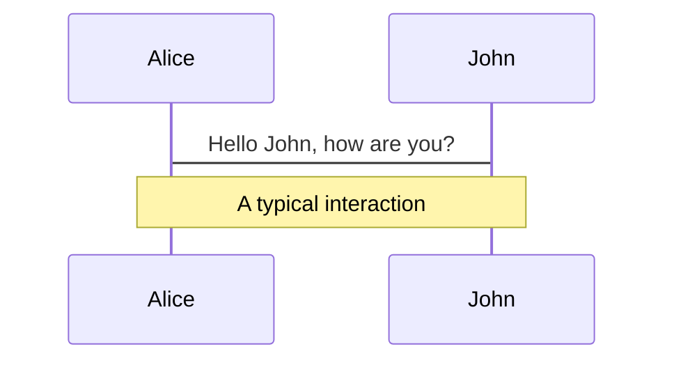
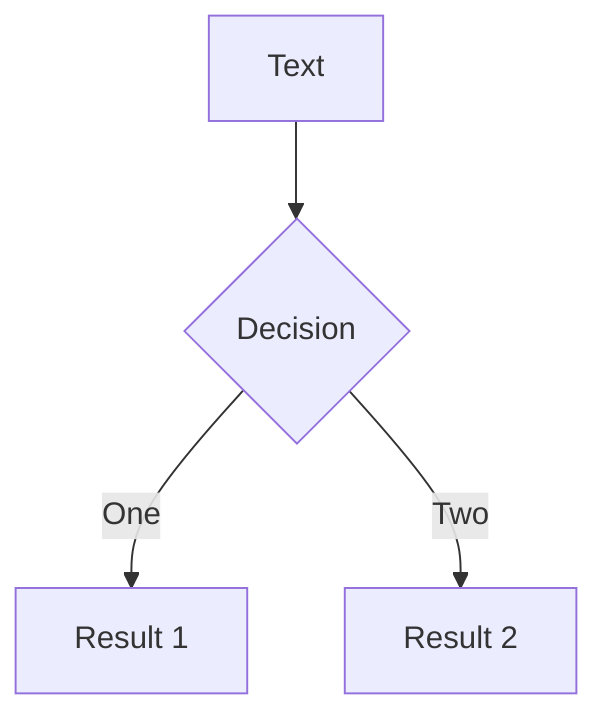
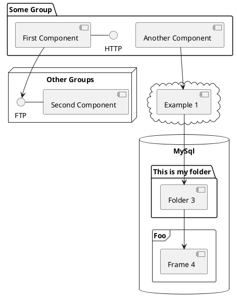

---
# try also 'default' to start simple
theme: seriph
# random image from a curated Unsplash collection by Anthony
# like them? see https://unsplash.com/collections/94734566/slidev
background: https://source.unsplash.com/collection/94734566/1920x1080
# apply any windi css classes to the current slide
class: 'text-center'
# https://sli.dev/custom/highlighters.html
highlighter: shiki
# show line numbers in code blocks
lineNumbers: false
# some information about the slides, markdown enabled
info: |
  ## Slidev Starter Template
  Presentation slides for developers.

  Learn more at [Sli.dev](https://sli.dev)
# persist drawings in exports and build
drawings:
  persist: false
---

# 모던 자바스크립트 Deep Dive

## week4 
14장 ~ 15장

<div class="pt-12">
  <span @click="$slidev.nav.next" class="px-2 py-1 rounded cursor-pointer" hover="bg-white bg-opacity-10">
    Press Space for next page <carbon:arrow-right class="inline"/>
  </span>
</div>

<!--
The last comment block of each slide will be treated as slide notes. It will be visible and editable in Presenter Mode along with the slide. [Read more in the docs](https://sli.dev/guide/syntax.html#notes)
-->

---
layout: center
class: text-center
---

# 14장
## 전역 변수의 문제점

---

# 변수의 생명주기
<div grid="~ cols-2 gap-10">
<div>

## 지역 변수의 생명 주기
지역 변수의 생명 주기는 함수의 생명 주기와 일치.  
단 누군가가 지역 변수의 메모리 공간을 참조하고 있으면 해제되지 않고 확보된 상태로 남아있게 되어서 함수의 생명주기와 다를 수 있다.


</div>
<div>

## 전역 변수의 생명 주기
var 키워드로 선언한 전역 변수는 전역 객체의 프로퍼티가 된다. 즉, 전역 변수의 생명 주기가 전역 객체의 생명 주기와 일치한다.


</div>
</div>

<style>
h2 {
  color: #9C904C;
  font-size: 1.5em !important;
}
</style>

---
class: px-20
---

### 지역 변수 생명주기 예제  

<div class="pt-10">

#### 주석 ??? 부분 결과 예측하기 🤔

```javascript  {all|2|4-7|11|5|all}

  var x = 'global';

  function foo() {
    console.log(x);  // ???
    var x = 'local';
  }

  foo();

  console.log(x); // global  

```

</div>

<div v-click="6" >
  <p>foo 함수 내부에서 선언된 지역 변수 x는 ??? 시점에 이미 선언되었고 undefined로 초기화되었다. <br>이처럼 호이스팅은 스코프 단위로 동작한다.</p>

  > 호이스팅이란? 변수 선언이 스코프의 선두로 끌어 올려진 것처럼 동작하는 자바스크립트 고유의 특징
</div>

<style>
h3 {
  color: #9C5170;
  font-size: 1.5em !important;
}
h4 {  
  margin-bottom: 10px;
  font-size: 1em !important;
}
p {
  font-size: 0.8em !important;
}
</style>

---

# 전역 변수의 문제점

## 암묵적 결합 
전역 변수를 선언한 의도는 코드 어디서든 참조하고 할당할 수 있는 변수를 사용하겠다는 것. 모든 코드가 전역 변수를 참조하고 변경할 수 있단 의미이다.

## 긴 생명 주기  
전역 변수는 생명 주기가 길어서 메모리 리소스도 오랜 기간 소비한다.  
var 키워드는 중복 선언을 허용하므로 전역 변수로 선언했을때 변수 이름이 중복될 가능성이 있고 의도치 않은 재할당이 이뤄질 수 있다.

## 스코프 체인 상에서 종점에 존재
변수를 검색할 때 전역 변수가 가장 마지막에 검색되어서 검색 속도가 가장 느리다. (검색 시 지역 스코프에서 전역 스코프로 올라가기 때문)

## 네임스페이스 오염
자바스크립트는 파일이 분리되어 있다 해도 전역 스코프를 공유한다. 따라서 동일한 이름을 가진 변수나 함수가 같은 스코프에 존재할 수 있으며 예상치 못한 결과를 가져올 수 있다.

<style>
h2 {
  color: #9C904C;
  font-size: 1em !important;
  margin-top: 1.3rem !important;
}
p {
  margin: 0.5em !important;
  font-size: 0.8em !important;
}
</style>

---

# 전역 변수의 사용을 억제하는 방법

1. 즉시 실행 함수
2. 네임스페이스 객체
3. 모듈 패턴
4. ES6 모듈


<p class="absolute bottom-23 left-10">

> 전역 변수를 반드시 사용해야 할 이유를 찾지 못한다면 지역 변수를 사용해야 한다. 변수의 스코프는 좁을수록 좋다.

</p>

<style>
ol {
  margin-top: 3rem !important;
}
ol li {
  font-size: 1.3em !important;
  margin-top: 1.3rem !important;
}
p {
  margin: 0.5em !important;
  font-size: 0.8em !important;
}
</style>

---

# 즉시 실행 함수
즉시 실행 함수는 단 한 번만 호출된다. 모든 코드를 즉시 실행 함수로 감싸면 모든 변수는 즉시 실행 함수의 지역 변수가 된다.

```javascript

  (function () {
    var foo = 10;
  }());
  
  console.log(foo); // ReferenceError: foo is not defined

```

---

# 네임스페이스 객체
전역에 네임스페이스 역할을 담당할 객체를 생성하고 전역 변수처럼 사용하고 싶은 변수를 프로퍼티로 추가하는 방법이다.  
네임스페이스를 분리해서 식별자 충돌을 방지하는 효과는 있으나 네임스페이스 객체 자체가 전역 변수에 할당되므로 유용하지 않다.

```javascript
  var MYAPP = {};

  MYAPP.name = "Choi";

  console.log(MYAPP.name); // Choi  

```

```javascript
  // 계층적 구조 가능
  var MYAPP = {};
  
  MYAPP.person = {
    name: 'Choi',
    address: 'Seoul' 
  };

  console.log(MYAPP.person.name) // Choi

```

---

# 모듈 패턴
모듈 패턴은 자바스크립트의 강력한 기능인 클로저를 기반으로 동작하고 전역 변수의 억제는 물론 캡슐화까지 구현할 수 있다.  
모듈 패턴은 전역 네임스페이스의 오염을 막는 기능은 한정적이지만 정보 은닉을 구현하기 위해 사용한다.

> '캡슐화'는 객체의 상태를 나타내는 프로퍼티와 프로퍼티를 참조하고 조작할 수 있는 동작인 메서드를 하나로 묶는것을 말한다.  
캡슐화는 객체의 특정 프로퍼티나 메서드를 감출 목적으로 사용하기도 하는데 이를 정보 은닉이라 한다.

> 자바스크립트는 public, private, protected 등의 접근 제한자를 제공하지 않는다.

```javascript
  // 계층적 구조 가능
  var MYAPP = {};
  
  MYAPP.person = {
    name: 'Choi',
    address: 'Seoul' 
  };

  console.log(MYAPP.person.name) // Choi

```

---
class: px-20
---

<div grid="~ cols-2 gap-4">
<div>

### 모듈 패턴 예제  

<div class="pt-10">

#### 자바스크립트에서 퍼블릭, 프라이빗 맴버 만들기 🤔

<div v-click="4">
  <p>예제에서 외부에 노출하고 싶은 변수나 함수를 객체에 담아 프로퍼티를 퍼블릭 맴버로 만들었다. 노출하고 싶지 않은 변수나 함수는 반환하는 객체에 추가하지 않으면 외부에서 접근할 수 없는 프라이빗 맴버가 된다.</p>
</div>

</div>
</div>

<div>

```javascript  {all|2-16|3-4,18-19|all}

  var Counter = (function () {
    // private 변수
    var num = 0;

    // 외부로 공개할 데이터나 메서드를 프로퍼티로 추가한 객체를 반환
    // public member
    return {
      increase() {
        return ++num;
      },
      decrease() {
        return --num;
      }
    }
  }());

  // private 변수는 외부로 노출되지 않는다
  console.log(Counter.num) // undefined
  
  console.log(Counter.increase()); // 1
  console.log(Counter.increase()); // 2
  console.log(Counter.decrease()); // 1
  console.log(Counter.decrease()); // 0


```
</div>
</div>

<style>
h3 {
  color: #9C5170;
  font-size: 1.5em !important;
}
h4 {  
  margin-bottom: 10px;
  font-size: 1em !important;
}
p {
  font-size: 0.8em !important;
}
</style>

---

# ES6 모듈
ES6 모듈은 파일 자체의 독자적인 모듈 스코프를 제공한다. script 테그에 type=”module” 어트리뷰트를 추가하면 로드된 자바스크립트 파일은 모듈로서 동작한다.

- mjs 확장자 권장.
- 구형 브라우저에서는 동작하지 않으며 브라우저의 ES6모듈 기능을 사용하더라도 트랜스파일링이나 번들링이 필요하다.

---

Slidev is a slides maker and presenter designed for developers, consist of the following features

- 📝 **Text-based** - focus on the content with Markdown, and then style them later
- 🎨 **Themable** - theme can be shared and used with npm packages
- 🧑‍💻 **Developer Friendly** - code highlighting, live coding with autocompletion
- 🤹 **Interactive** - embedding Vue components to enhance your expressions
- 🎥 **Recording** - built-in recording and camera view
- 📤 **Portable** - export into PDF, PNGs, or even a hostable SPA
- 🛠 **Hackable** - anything possible on a webpage

<br>
<br>

Read more about [Why Slidev?](https://sli.dev/guide/why)

<!--
You can have `style` tag in markdown to override the style for the current page.
Learn more: https://sli.dev/guide/syntax#embedded-styles
-->

<style>
h1 {
  background-color: #2B90B6;
  background-image: linear-gradient(45deg, #4EC5D4 10%, #146b8c 20%);
  background-size: 100%;
  -webkit-background-clip: text;
  -moz-background-clip: text;
  -webkit-text-fill-color: transparent;
  -moz-text-fill-color: transparent;
}
</style>

---

# Navigation

Hover on the bottom-left corner to see the navigation's controls panel, [learn more](https://sli.dev/guide/navigation.html)

### Keyboard Shortcuts

|     |     |
| --- | --- |
| <kbd>right</kbd> / <kbd>space</kbd>| next animation or slide |
| <kbd>left</kbd>  / <kbd>shift</kbd><kbd>space</kbd> | previous animation or slide |
| <kbd>up</kbd> | previous slide |
| <kbd>down</kbd> | next slide |

<!-- https://sli.dev/guide/animations.html#click-animations -->

<p v-after class="absolute bottom-23 left-45 opacity-30 transform -rotate-10">Here!</p>

---
layout: image-right
image: https://source.unsplash.com/collection/94734566/1920x1080
---

# Code

Use code snippets and get the highlighting directly![^1]

```ts {all|2|1-6|9|all}
interface User {
  id: number
  firstName: string
  lastName: string
  role: string
}

function updateUser(id: number, update: User) {
  const user = getUser(id)
  const newUser = { ...user, ...update }
  saveUser(id, newUser)
}
```

<arrow v-click="3" x1="400" y1="420" x2="230" y2="330" color="#564" width="3" arrowSize="1" />

[^1]: [Learn More](https://sli.dev/guide/syntax.html#line-highlighting)

<style>
.footnotes-sep {
  @apply mt-20 opacity-10;
}
.footnotes {
  @apply text-sm opacity-75;
}
.footnote-backref {
  display: none;
}
</style>

---

# Components

<div grid="~ cols-2 gap-4">
<div>

You can use Vue components directly inside your slides.

We have provided a few built-in components like `<Tweet/>` and `<Youtube/>` that you can use directly. And adding your custom components is also super easy.

```html
<Counter :count="10" />
```

<!-- ./components/Counter.vue -->
<Counter :count="10" m="t-4" />

Check out [the guides](https://sli.dev/builtin/components.html) for more.

</div>
<div>

```html
<Tweet id="1390115482657726468" />
```

<Tweet id="1390115482657726468" scale="0.65" />

</div>
</div>


---
class: px-20
---

# Themes

Slidev comes with powerful theming support. Themes can provide styles, layouts, components, or even configurations for tools. Switching between themes by just **one edit** in your frontmatter:

<div grid="~ cols-2 gap-2" m="-t-2">

```yaml
---
theme: default
---
```

```yaml
---
theme: seriph
---
```


</div>

Read more about [How to use a theme](https://sli.dev/themes/use.html) and
check out the [Awesome Themes Gallery](https://sli.dev/themes/gallery.html).

---
preload: false
---

# Animations

Animations are powered by [@vueuse/motion](https://motion.vueuse.org/).

```html
<div
  v-motion
  :initial="{ x: -80 }"
  :enter="{ x: 0 }">
  Slidev
</div>
```

<div class="w-60 relative mt-6">
  <div class="relative w-40 h-40">
    
    
    
  </div>

  <div
    class="text-5xl absolute top-14 left-40 text-[#2B90B6] -z-1"
    v-motion
    :initial="{ x: -80, opacity: 0}"
    :enter="{ x: 0, opacity: 1, transition: { delay: 2000, duration: 1000 } }">
    Slidev
  </div>
</div>

<!-- vue script setup scripts can be directly used in markdown, and will only affects current page -->
<script setup lang="ts">
const final = {
  x: 0,
  y: 0,
  rotate: 0,
  scale: 1,
  transition: {
    type: 'spring',
    damping: 10,
    stiffness: 20,
    mass: 2
  }
}
</script>

<div
  v-motion
  :initial="{ x:35, y: 40, opacity: 0}"
  :enter="{ y: 0, opacity: 1, transition: { delay: 3500 } }">

[Learn More](https://sli.dev/guide/animations.html#motion)

</div>

---

# LaTeX

LaTeX is supported out-of-box powered by [KaTeX](https://katex.org/).

<br>

Inline $\sqrt{3x-1}+(1+x)^2$

Block
$$
\begin{array}{c}

\nabla \times \vec{\mathbf{B}} -\, \frac1c\, \frac{\partial\vec{\mathbf{E}}}{\partial t} &
= \frac{4\pi}{c}\vec{\mathbf{j}}    \nabla \cdot \vec{\mathbf{E}} & = 4 \pi \rho \\

\nabla \times \vec{\mathbf{E}}\, +\, \frac1c\, \frac{\partial\vec{\mathbf{B}}}{\partial t} & = \vec{\mathbf{0}} \\

\nabla \cdot \vec{\mathbf{B}} & = 0

\end{array}
$$

<br>

[Learn more](https://sli.dev/guide/syntax#latex)

---

# Diagrams

You can create diagrams / graphs from textual descriptions, directly in your Markdown.

<div class="grid grid-cols-3 gap-10 pt-4 -mb-6">







</div>

[Learn More](https://sli.dev/guide/syntax.html#diagrams)


---
layout: center
class: text-center
---

# Learn More

[Documentations](https://sli.dev) · [GitHub](https://github.com/slidevjs/slidev) · [Showcases](https://sli.dev/showcases.html)
