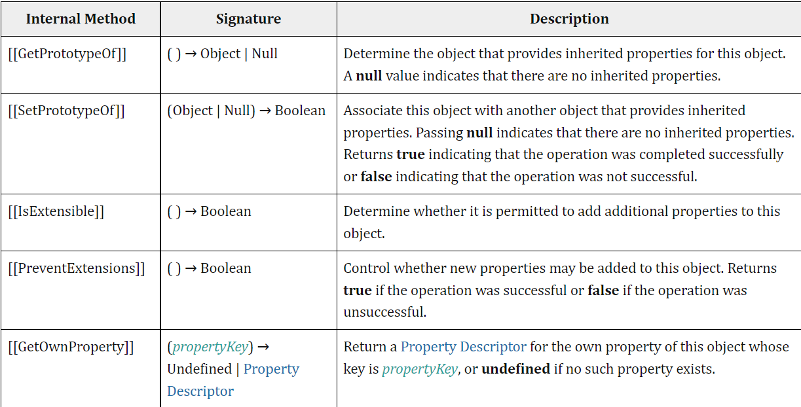
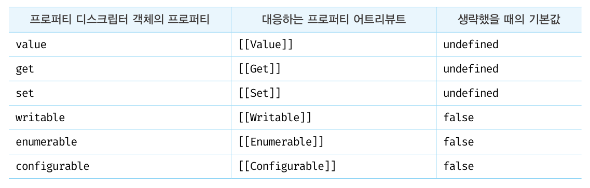
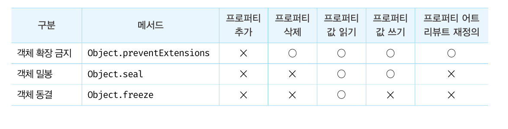
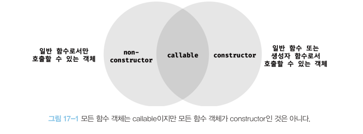

---
# try also 'default' to start simple
theme: apple-basic
layout: intro-image
image: https://img.postshare.co.kr/images/2016/10/31101742/tele.jpg
---

<div class="absolute top-10">
  <span class="font-700">
    2022.05.05
  </span>
</div>

<div class="absolute bottom-10 highlight">
  <h1>자바스크립 스터디 5회차</h1>
  <p>프로퍼티 어트리뷰트와 생성자 함수에 의한 객체생성</p>
</div>
<!-- prettier-ignore -->
---
layout: intro-image-right
image: ./images/의사코드.svg
---
# 의사코드란?

<p>의사(疑似: 비교할 의, 비슷할 사 | Pseudo: 가짜</p>
<p class="red">사람의 언어로 만든 코드</p>
---

# 내부슬롯과 내부 메서드

<p class="mt-10">자바스크립트 엔진의 구현 알고리즘을 설명하기 위해 ECMAScript 사양에서 사용되는<br/> <span class="red">의사 프로퍼티와 의사 메서드</span></p>


<style>
.mt-10 {
  margin-top: 10px;
}
img {
margin: 0 auto;
}
</style>

---

# 내부슬롯과 내부 메서드

<p class="mt-10">내부 슬롯과 내부 메서드는 자바스크립트 엔진의 내부 로직이므로<br/> <span class="red">직접 접근할 수 없다</span></p>

<p>단, 일부 내부 슬롯과 내부 메서드에 한하여 간접적으로 접근할 수 있는 방법을 제공한다.</p>

```js
const o = {};

o.[[Prototype]]; // Uncaught Syntax Error

o.__proto__; // Object.prototype
```

<style>
.mt-10 {
  margin-top: 10px;
}
</style>

---

# 프로퍼티 어트리뷰트와 디스크립터 객체

<p class="mt-10">자바스크립트 엔진은 프로퍼티를 생성할 때, <br/>프로퍼티 상태를 나타내는 프로퍼티 어트리뷰트를 기본값으로 자동 정의한다.</p>

<div class="container mt-10">
<div>
<h3>프로퍼티 상태</h3>

- 값(value)
- 갱신 가능 여부(writable)
- 열거 가능 여부(enumerable)
- 재정의 가능여부(configurable)
</div>

<div class="ml-10 ">
<h3>프로퍼티 어트리뷰트(내부 슬롯)</h3>

- [[Value]]
- [[Writable]]
- [[Enumerable]]
- [[Configurable]]
</div>
</div>

<p class="highlight">프로퍼티 어트리뷰트는 내부슬롯이므로 직접 확인할 수 없다</p>

<style>
.mt-10 {
  margin-top: 10px;
}
.container {
  display: flex;
  justify-content:center;
  margin-top: 50px;
  margin-bottom: 50px;
}
.ml-10 {
  margin-left: 50px;
}

.highlight{
  font-size: 24px;
  font-weight: 900;
  color: red;
}
</style>

---

# 디스크립터 객체

<div>
<p>Object.getOwnPropertyDescriptor</p>

```js
const person = {
  name: 'Lee';
}

// 프로퍼티 어트리뷰트 정보를 제공하는 프로퍼티 디스크립터 객체럴 반환한다.
console.log(Object.getOwnPropertyDescriptor(person, 'name'));

// {value: 'Lee', writable: true, enumerable: true, configurable: true}
```

</div>

<div>
<p>Object.getOwnPropertyDescriptors</p>

```js
const person = {name: 'Lee';}
person.age = 20;

console.log(Object.getOwnPropertyDescriptors(person, 'name'));
//
 {
  name: {value: 'Lee', writable: true, enumerable: true, configurable: true},
  age: value: 20, writable: true, enumerable: true, configurable: true}
  }

```

</div>

<style>
.mt-10 {
  margin-top: 10px;
}
.container {
  display: flex;
  justify-content:center;
  margin-top: 50px;
  margin-bottom: 50px;
}


.highlight{
  font-size: 24px;
  font-weight: 900;
  color: red;
}
</style>

---

# 데이터 프로퍼티와 접근자 프로퍼티

- 데이터 프로퍼티
<p>키와 값으로 구성된 일반적인 프로퍼티</p>

- 접근자 프로퍼티
<p>자체적으로 값을 갖지 않고, 다른 데이터 프로퍼티의 값을 읽거나 저장할 때 <br/>호출되는 접근자 함수로 구성된 프로퍼티</p>

---

# 데이터 프로퍼티

- value / [[Value]]
- writable / [[Writable]]
- enumerable / [[Enumerable]]
- configurable / [[Configuralble]]

```js
const person = {
  name: "Lee";
}

console.log(Object.getOwnPropertyDescriptor(person, "name"));

// {value: "Lee", writable: true, enumerable: true, configurable: true}

```

```js
const person = {
  name: "Lee";
  age: 20;
}

console.log(Object.getOwnPropertyDescriptors(person));

// {name: {value: "Lee", writable: true, enumerable: true, configurable: true}, age: {value: 20, writable: true, enumerable: true, configurable: true}}

```

---

# 접근자 프로퍼티

- get / [[Get]]
- set / [[Set]]
- enumerable / [[Enumerable]]
- configurable / [[Configurable]]

```js
const person = {
  firstName: 'himchan';
  lastName: 'kim';

  get fullName() {
    return `${this.firstName} ${this.lastName}`;
  }

  set fullName(name) {
    [this.firstName, this.lastName] = name.split('');
  }
}

let descriptor = Object.getOwnPropertyDescriptor(person, 'fullName');

console.log(descriptor);
// {get: f, set: f, enumerable: true, configurable: true}

```

---

# 프로퍼티 정의

Object.defineProperty 메서드로 프로퍼티 어트리뷰트 정의 가능

```js
const person = {};

Object.defineProperty(person, "firstName", {
  value: "himchan",
  writable: true,
  enumerable: true,
  configurable: true,
});

console.log(Object.getOwnPropertyDescriptor(person, 'firstName));
// {value: 'himchan', writable:true, enumerable: true, configurable: true}

```

(Object.defineProperties를 통해 여러 개의 프로퍼티 어트리뷰트 정의도 가능)

---

# 프로퍼티 정의 기본값



---

# 객체 변경 방지



---

# 객체 확장 금지(Object.preventExtensions)

```js
const person = { name: "lee" };

Object.preventExtensions(person);

console.log(Object.isExtensible(person)); // false

// 프로퍼티 추가 금지
person.age = 20; // 무시 strict mode에서는 에러

delete person.name; // 삭제는 가능

// 프로퍼티 정의에 의한 프로퍼티 추가도 금지
Object.defineProperty(person, "age", { value: 20 }); // TypeError: Cannot define property age, object is not extensible
```

---

# 객체 밀봉(Object.isSealed)

```js
const person = { name: "lee" };

Object.seal(person);

console.log(Object.isSealed(person)); // true

// 밀봉된 객체는 configurable이 false다.
console.log(Object.getOwnPropertyDescriptors(person));
/*
{
  name: {value: 'lee', writable: true, enumerable: true, configurable: false}
}
*/

person.age = 20; // 프로퍼티 추가가 금지된다.
delete person.name; // 프로퍼티 삭제가 금지된다.

person.name = "kim"; // 프로퍼티 값 갱신은 가능하다.

Object.defineProperty(person, "name", { configurable: true }); // 프로퍼티 어트리뷰트 재정의가 금지된다.
```

---

# 객체동결(Object.freeze)

```js
const person = { name: "lee" };

Object.freeze(person);

console.log(Object.isFrozen(person)); // true

// 동결된 객체는 configurable이 false다.
console.log(Object.getOwnPropertyDescriptors(person));
/*
{
  name: {value: 'lee', writable: false, enumerable: true, configurable: false}
}
*/

person.age = 20; // 프로퍼티 추가가 금지된다.
delete person.name; // 프로퍼티 삭제가 금지된다.

person.name = "kim"; // 프로퍼티 값 갱신이 금지된다.

Object.defineProperty(person, "name", { configurable: true }); // 프로퍼티 어트리뷰트 재정의가 금지된다.
```

---

# 불변객체

<br/>
위의 변경 방지 메서드들은 <span class="red">얕은 변경 방지</span>이다

```js
const person = {
  name: "Lee",
  address: { city: "Seoul" },
};

// 얕은 객체 동결
Object.freeze(person);

console.log(Object.isFrozen(person)); // true

console.log(Object.isFrozen(person.address)); // false
```

깊은 변경 방지를 하고 싶다면, 재귀적으로 Object.freeze 메서드를 호출해야 한다.

---

# 생성자 함수에 의한 객체 생성

<div class="mt-10 mb-10"><h2>생성자 함수란?</h2></div>
<span>new 연산자와 함께 호출하여 객체(인스턴스)를 생성하는 함수</span>

```js
const person = new Object();

// 프로퍼티 추가
person.name = "lee";
person.sayHello = function () {
  console.log(`Hi, My name is ${this.name}`);
};

console.log(person); // {name: 'lee', sayHello: f}
```

<p class="red">반드시 Object 생성자 함수를 사용해 빈 객체를 생성해야 하는 것은 아니다. <br/>(특별한 이유가 없다면 그다지 유용하지 않음)
</p>

<style>
  .mt-10 {
  margin-top: 10px;
}

.mb-10{
margin-bottom: 10px;
}
</style>

---

# 객체 리터럴에 의한 객체 생성 방식의 문제점

```js
const circle1 = {
  radius: 5,
  getDiameter() {
    return 2 * this.radius;
  },
};

console.log(circle1.getDiameter()); // 10

const circle2 = {
  radius: 10,
  getDiameter() {
    return 2 * this.radius;
  },
};

console.log(circle2.getDiameter()); // 20
```

프로퍼티 구조가 동일함에도 불구하고 매번 같은 프로퍼티와 메서드를 기술해야 한다.

---

# 생성자 함수에 의한 객체 생성 방식의 장점(feat. 붕어빵)

```js
function Circle(radius) {
  this.radius = radius;
  this.getDiameter = function () {
    return 2 * this.radius;
  };
}

// 인스턴스 생성
const circle1 = new Circle(5);
const circle2 = new Circle(10);

console.log(circle1.getDiameter()); // 10
console.log(circle2.getDiameter()); // 20
```

같은 구조의 객체를 간단하게 만들 수 있다!

---

# this

<p class="mt-10">this는 객체 자신의 프로퍼티나 메서드를 참조하기 위한 자기 참조 변수다.</p>
<p>this 바인딩은 함수 호출 방식에 따라 동적으로 결정된다.</p>

<table class="mt-20">
  <thead>
    <tr>
      <th style="width:50%"  class="text-center bold">함수 호출 방식</th>
      <th  class="text-center bold" style="width:50%">this가 가리키는 값(this 바인딩)</th>
    </tr>
  </thead>
  <tbody>
    <tr>
      <td class="text-center">일반 함수로서 호출</td>
      <td class="text-center">전역 객체</td>
    </tr>
    <tr>
      <td class="text-center">메서드로서 호출</td>
      <td class="text-center">메서드를 호출한 객체(마침표 앞의 객체)</td>
    </tr>
    <tr>
      <td class="text-center">생성자 함수로서 호출</td>
      <td class="text-center">생성자 함수가 생성할 인스턴스</td>
    </tr>
  </tbody>
</table>

<style>
.mt-10 {
  margin-top: 10px;
}

.mb-10{
margin-bottom: 10px;
}

.text-center {
  text-align: center;
}

.bold {
  font-weight: 900;
}
</style>

---

# this

```js
function foo() {
  console.log(this);
}

// 일반 함수로서 호출
foo(); // window

// 메서드로서 호출
const obj = { foo };

obj.foo(); // obj

// 생성자 함수로서 호출
const inst = new foo(); // inst
```

---

# 생성자 함수의 인스턴스 생성 과정

<h2 class="mt-10">1. 인스턴스 생성과 this 바인딩</h2>
<p>암묵적으로 빈 객체가 생성된다. </p>
<p>이 빈 객체가 생성자 함수가 생성한 인스턴스다. <br/> <span class="red">인스턴스는 this에 바인딩 된다.</span></p>
<p>생성자 함수 내부의 this가 생성자 함수가 생성할 인스턴스를 가리키는 이유</p>

```js
function Circle(radius) {
  // 1. 암묵적으로 인스턴스가 생성되고 this에 바인딩된다.

  console.log(this); // {}

  this.radius = radius;
  this.getDiameter = function () {
    return 2 * this.radius;
  };
}
```

<style>
.mt-10 {
  margin-top: 10px;
}

.red {
  color: red;
  font-weight: 900;
}

</style>

---

# 생성자 함수의 인스턴스 생성 과정

<h2 class="mt-10">2. 인스턴스 초기화</h2>
<p>this에 바인딩되어 있는 인스턴스에 프로퍼티나 메서드를 추가하고,<br/> 생성자 함수가 인수로 전달받은 초기값을 인스턴스 프로퍼티에 할당하여 초기화하거나 고정값을 할당한다. </p>

```js
function Circle(radius) {
  // 1. 암묵적으로 인스턴스가 생성되고 this에 바인딩된다.

  // 2. this에 바인딩되어 있는 인스턴스를 초기화한다.
  this.radius = radius;
  this.getDiameter = function () {
    return 2 * this.radius;
  };
}
```

<style>
.mt-10 {
  margin-top: 10px;
}

.red {
  color: red;
  font-weight: 900;
}

</style>

---

# 생성자 함수의 인스턴스 생성 과정

<h2 class="mt-10">3. 인스턴스 반환</h2>
<p>완성된 인스턴스가 암묵적으로 반환된다. </p>

```js
function Circle(radius) {
  // 1. 암묵적으로 인스턴스가 생성되고 this에 바인딩된다.

  // 2. this에 바인딩되어 있는 인스턴스를 초기화한다.
  this.radius = radius;
  this.getDiameter = function () {
    return 2 * this.radius;
  };

  // 완성된 인스턴스(this)가 암묵적으로 반환된다.
}

// 인스턴스 생성. Circle 생성자 함수는 암묵적으로 this를 반환한다.

const circle = new Circle(1);
console.log(circle); // Circle {radius: 1, getDiameter: f}
```

<style>
.mt-10 {
  margin-top: 10px;
}

.red {
  color: red;
  font-weight: 900;
}

</style>

---

# 생성자 함수의 인스턴스 생성 과정

<h2 class="mt-10">return을 명시했을 때</h2>
<p>this가 아닌 다른 객체를 return 문으로 반환하면 this가 반환되지 못하고 return 문에 명시한 객체가 반환된다.</p>
<p>명시적으로 원시 값을 반환하면 원시 값 반환은 무시되고, this가 반환된다</p>

```js
function Circle(radius) {
  this.radius = radius;
  this.getDiameter = function () {
    return 2 * this.radius;
  };

  return {};
}

const circle = new Circle(1);
console.log(circle); // {}
```

<p class="red">생성자 함수 내부에서 return 문이 있다면, 어떤 버그가 발생할 지 모르니 return문은 반드시 생략해주자!</p>

<style>
.mt-10 {
  margin-top: 10px;
}

.red {
  color: red;
  font-weight: 900;
}

</style>

---

# 내부 메서드 [[Call]]과 [[Construct]]

<p class="mt-10">함수는 객체이므로 일반 객체와 동일하게 동작할 수 있다. <br/> 함수 객체는 일반 객체가 가지고 있는 내부 슬롯과 내부 메서드를 모두 가지고 있기 때문이다.</p>

<p>함수는 객체이지만, 일반 객체와는 다르다
<br/>
일반 객체는 호출할 수 없지만, 함수는 호출할 수 있다.</p>

<p class="red">함수 객체는 일반함수에는 없는 [[Environment]], [[FormalParameters]] 등의 내부 슬롯과 <br/>[[Call]], [[Construct]] 내부 메서드를 가지고 있다!</p>

```js
function foo() {}

// 일반적인 함수로서 호출: [[Call]]이 호출된다.
foo();

// 생성자 함수로서 호출: [[Construct]]가 호출된다.
new foo();
```

<style>
.mt-10 {
  margin-top: 10px;
}

.red {
  color: red;
  font-weight: 900;
}

</style>

---

# constructor와 non-construcotr의 구분



- constructor: 함수 선언문, 클래스

* non-constructor: 메서드(ES6 메서드 축약 표현), 화살표 함수

<style>
  img{
    margin: 50px auto;
  }

</style>

---

# constructor와 non-construcotr의 구분

```js
// 일반 함수 정의: 함수 선언문, 함수 표현식
function foo() {}
const bar = function () {};
// 프로퍼티 x의 값으로 할당된 것은 일반 함수로 정의된 함수다.
// 이는 메서드로 인정하지 않는다.
const baz = {
  x: function () {},
};

// 일반 함수로 정의된 함수만이 constructor다.
new foo(); // -> foo{}
new bar(); // -> bar{}
new baz.x(); // -> x {}

// 화살표 함수 정의
const arrow = () => {};
new arrow(); // TypeError: arrow is not a constructor

// 메서드 정의: ES6의 메서드 축약 표현만 메서드로 인정한다.
const obj = {
  x() {},
};

new obj.x(); // TypeError: obj.x is not a constructor
```

---

# new 연산자

<p>new 연산자와 함께 함수를 호출하면 해당 함수는 생성자 함수로 동작한다.[[Construct]]</p>
<p>반대로 new 연산자 없이 생성자 함수를 호출하면 일반 함수로 호출된다. [[Call]]</p>

```js
function Circle(radius) {
  this.radius = radius;
  this.getDiameter = function () {
    return 2 * this.radius;
  };
}

// new 연산자 없이 생성자 함수를 호출하면 일반 함수로서 호출된다.

const circle = Circle(5);
console.log(circle); // undefined

// 일반 함수 내부 this는 전역 객체 window를 가리킨다.
console.log(radius); // 5
console.log(getDiameter()); // 10

circle.getDiameter();
// TypeError: Cannot read property 'getDiamter of undefined
```

---

# new.target

<p>생성자 함수가 new 연산자 없이 호출되는 것을 방지하기 위해서 파스칼 케이스 컨벤션을 사용하더라도 <br/><span class="red">실수는 언제나 발생한다</span></p>

## ES6에서는 new.target을 지원한다.

- new 연산자와 함께 생성자 함수로서 호출되면 함수 내부의 new.target은 함수 자신을 가리킨다.
- new 연산자와 없이 일반 함수로 호출되면 함수 내부의 new.target은 undefined다.

```js
function Circle(radius) {
  if (!new.target) {
    return new Circle(radius);
  }

  this.radius = radius;
  this.getDiameter = function () {
    return 2 * this.radius;
  };
}

const cirle = Circle(5);
console.log(circle.getDiameter()); // 10
```

<style>
.mt-10 {
  margin-top: 10px;
}

.red {
  color: red;
  font-weight: 900;
}

</style>

---

# 스코프 세이프 생성자 패턴

<p>new.target은 ES6에서 도입된 최신 문법이므로 IE에서는 지원하지 않는다. <br/>이때는 스코프 세이프 생성자 패턴을 사용한다.</p>

```js
function Circle(radius) {
  if (!(this instanceof Circle)) {
    return new Circle(radius);
  }

  this.radius = radius;
  this.getDiameter = function () {
    return 2 * this.radius;
  };
}

const cirle = Circle(5);
console.log(circle.getDiameter()); // 10
```

---

# 빌트인 생성자 함수

- new 키워드가 없어도 생성자 함수로 동작

```js
let obj = new Object();
console.log(obj); // {}

obj = Object();
console.log(obj); // {}

let f = new Function("x", "return x ** x");
console.log(f); // f anonymous(x) {return x ** x}

f = Function("x", "return x ** x");
console.log(f); // f anonymous(x) {return x ** x}
```

- String, Number, Boolean 생성자 함수는 new 연산자 없이 호출하면 문자열, 숫자, 불리언 값을 반환

```js
const num = 123;

const newStr = new String(num);
console.log(newStr, typeof newStr); //  String {'123'} 'object'

const str = String(num);
console.log(str, typeof str); // 123 'string'
```
